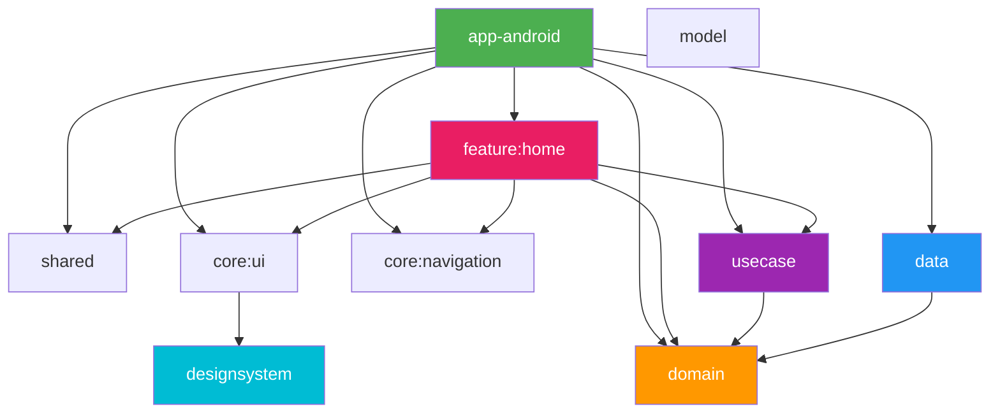

# App Skeleton

A template repository for mobile apps built with Kotlin Multiplatform.

## Architecture

Clean Architecture with a multi-module structure.

## Tech Stacks

- Android
    - Jetpack Compose
    - Material 3
    - Navigation3
    - Edge-to-Edge
    - Metro (compile-time DI)
- iOS
    - SwiftUI
    - Shared framework (static)
- Kotlin Multiplatform
    - Coroutines
    - SQLDelight
    - Kermit
- Testing
    - Mokkery
    - Turbine
    - Kotest
- Development
    - Convention Plugins (`build-logic/`)
    - Gradle Version Catalog

## Setup

1. Clone this repository
2. Open in Android Studio
3. Sync Gradle
4. Run `app-android` configuration
